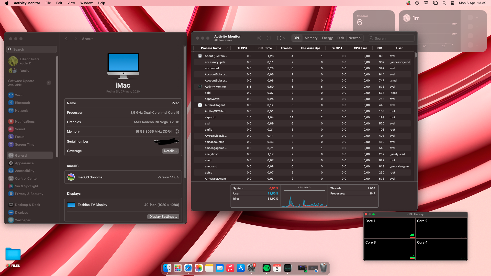

# OpenCore EFI for AMD Ryzen 5700G Hackintosh

## Hardware Configuration

- **CPU**: AMD Athlon 3000G with Radeon Graphics
- **GPU**: Integrated AMD Radeon Vega 3 Graphics
- **Motherboard**: ASUS PRIME AM4 A320M-K 
- **RAM**: **Total Size**: 16 GB 8x2 DDR4 3200MHZ (running in 3066mhz)
- **Storage**: SSD
- **WiFi/BT**: No Module, Running on LAN ( no native WIFI/BT support )
- **Audio**: Realtek ALC887

## Installation Instructions

1. **Prepare the USB Drive**: Use a USB drive (at least 16GB) and format it as FAT32.
2. **Download OpenCore**: Get the latest OpenCore release from [OpenCore Releases](https://github.com/acidanthera/OpenCorePkg/releases).
3. **Create EFI Folder**: Copy the `EFI` folder from the OpenCore release into the EFI partition of the USB drive.
4. **Configure config.plist**: Edit the `config.plist` file using ProperTree or a similar tool.
5. **Kexts and Drivers**: Place necessary kexts in the `Kexts` folder and drivers in the `Drivers` folder.
6. **ACPI Patches**: Add any necessary ACPI patches for your specific hardware.
7. **Boot from USB**: Reboot your system and select the USB drive to boot into OpenCore.

## Screenshots

## Notes

- Ensure your BIOS settings are optimized for macOS (disable Secure Boot, enable AHCI, etc.).
- Use appropriate USB ports for installation (usually USB 2.0 ports work best).

## Troubleshooting

- If you encounter boot issues, check your BIOS settings and ensure your USB drive is correctly formatted and configured.

Credits

Dortania OpenCore Guide

- Refer to the [OpenCore documentation](https://dortania.github.io/OpenCore-Install-Guide/) for additional help and resources.

## License

MIT License

Copyright (c) 2026 ELAVL-BAT
